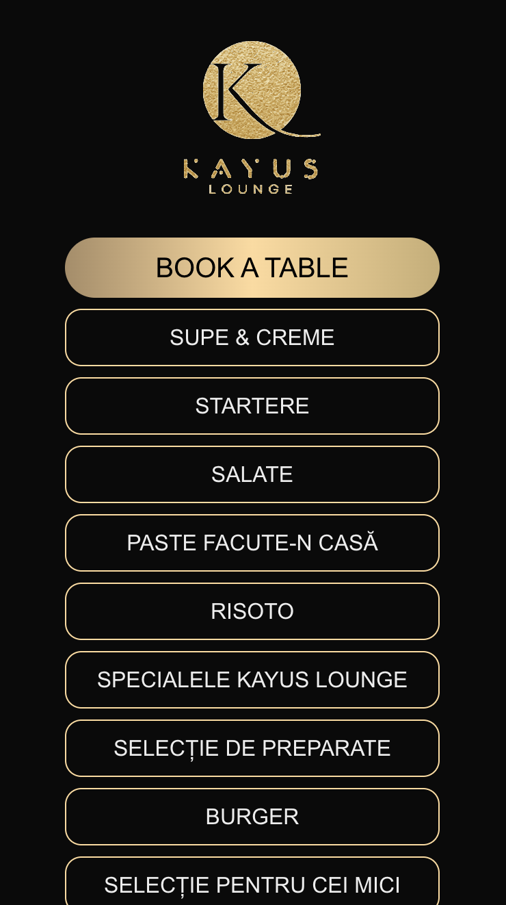

## Kayus menu website

Before anything, thank you for checking out this project. If you have questions, please reach out to me. 
Since this is a production build, I urge everyone to check the [website](https://menu.kayus.ro/lounge/)
and the [license agreement](./LICENSE.md#-strict-license--terms-of-use). Please do not redistribute, commercialize or impersonate.
Thanks!


## 

# Develop locally

```bash
npm run dev

```
Open [http://localhost:3000](http://localhost:3000) with your browser to see the result.

You can start editing the page by modifying `app/page.tsx`. The page auto-updates as you edit the file.

This project uses [`next/font`](https://nextjs.org/docs/app/building-your-application/optimizing/fonts) to automatically optimize and load [Geist](https://vercel.com/font), a new font family for Vercel.

## Learn More
The app is build using [Next.js](https://nextjs.org/).
For CSM Contentful has been used.

- [Next.js Documentation](https://nextjs.org/docs) - learn about Next.js features and API.
- [Learn Next.js](https://nextjs.org/learn) - an interactive Next.js tutorial.

## Data structure
The app has 4 main data structures:
- FoodCategory - Menu
- FoodItems - food products
- DrinkItems - drink products
- DrinkSections - used to separate drinks into sections (e.g. "soft drinks"; "beer"; etc.) 
- Promotions - the banner that appear on the home page (when toggeled on)

